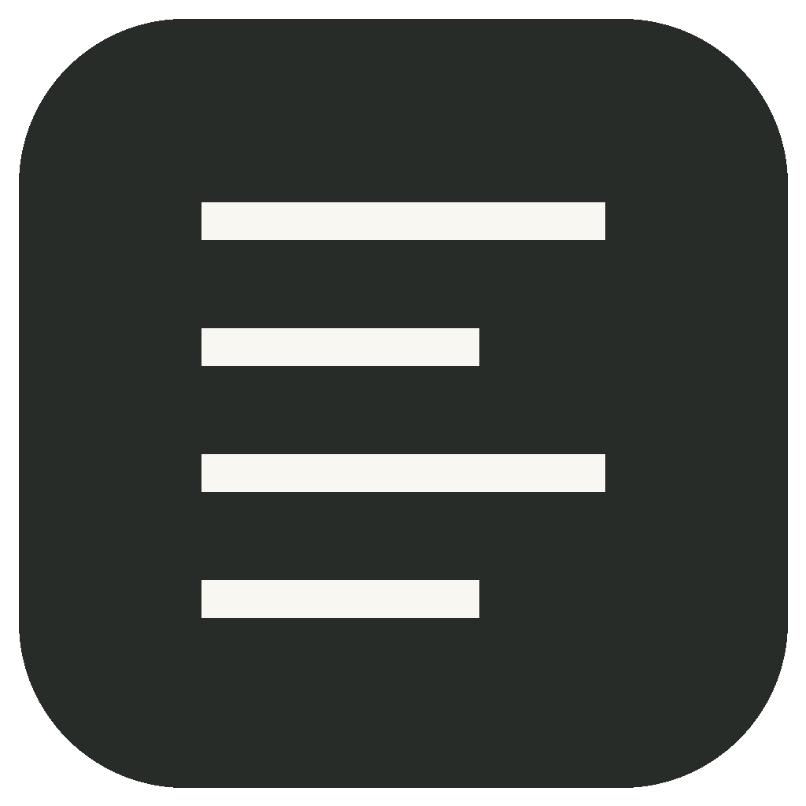

<p align="center"></p>
<h1 align="center">Skill-Desk</h1>
<p align="center">Discover, create and manage the skills behind your AI work.</p>
<p align="center"><a href="https://github.com/ldgraham92/skill-desk/actions/workflows/desktop.yml"></a> <a href="LICENSE"></a></p>

Skill-Desk is a free, open-source desktop manager for personal AI skills. It keeps your skill files on your machine and uses your installed, signed-in Codex or Claude Code CLI when you ask it to author a skill. Reference guidance is generated for new or changed skills and cached locally.

**[Download a desktop release](https://github.com/ldgraham92/skill-desk/releases)** · **[Report a bug](https://github.com/ldgraham92/skill-desk/issues/new/choose)** · **[Try the standalone demo](marketing/index.html)**

## What it does

- Browse and search globally installed skills, save favorites, and copy example prompts.
- Create a skill from a brief, track progress, review its instructions, and install it.
- Import pasted Markdown, an MD file, or a complete skill folder from GitHub.
- Track User Created, Repo Installed, Markdown Imported and Existing origins.
- Archive removed skills and restore them with installation-conflict checks.
- Refresh the library when skill files change.
- Choose Codex or Claude Code as the authoring provider, using its existing CLI login.

The desktop window and bundled local service start together. The tray menu opens or hides the window. Closing the window or choosing Quit stops the service. Installed skills remain available to their agents when Skill-Desk is closed.

## Install

Choose the appropriate asset from [Releases](https://github.com/ldgraham92/skill-desk/releases):

| Platform | Installer |
| --- | --- |
| Windows x64 | `*-setup.exe` |
| macOS | `.dmg`, with the CPU architecture in the filename |
| Debian/Ubuntu Linux x64 | `.deb` |

Python is bundled. Browsing and Markdown imports do not require an AI account. AI authoring requires an installed and signed-in Codex or Claude Code CLI. GitHub repository imports require Git. CLI usage consumes your provider account's allowance; Skill-Desk does not operate a paid generation service.

The initial releases are unsigned previews. Windows/Linux graphical installation and runtime testing are still being collected. There is no in-app updater yet; download newer releases from GitHub.

The desktop app currently manages `~/.agents/skills`. Authoring-provider selection does not change the installation directory. The development server supports `--library claude` for `~/.claude/skills`; a desktop library selector is planned.

## Development

Skill-Desk uses Tauri, HTML/CSS/JavaScript, and a bundled Python service. See [DESKTOP.md](DESKTOP.md) for platform prerequisites and full build instructions.

```sh
python -m venv .venv
# Activate the virtual environment for your shell first.
python -m pip install -r requirements-build.txt
npm ci
python scripts/check_version.py
python -m unittest discover -s tests -v
python scripts/build_sidecar.py
python scripts/smoke_sidecar.py
npm run desktop:dev
```

Build a distributable installer with `npm run desktop:build`. The [Actions workflow](.github/workflows/desktop.yml) builds and tests on Windows, macOS and Linux. Version tags publish installers and SHA-256 checksums to GitHub Releases only after every platform succeeds.

## Project guides

- [Features and local server](LIVE-SYNC.md)
- [Desktop packaging and platform checks](DESKTOP.md)
- [Contributing](CONTRIBUTING.md) and [community conduct](CODE_OF_CONDUCT.md)
- [Security reporting](SECURITY.md)
- [Release process](docs/RELEASING.md) and [changelog](CHANGELOG.md)
- [Host the marketing page with Coolify](docs/COOLIFY.md)

## Roadmap

Curated and user-added skill libraries, a desktop library selector, signed installers, app updates, and reusable integration boundaries for other tools. These are planned features, not capabilities of the first release.

## License and attribution

Skill-Desk is MIT licensed. See [LICENSE](LICENSE). The original bundled skill/reference material retains its separate copyright notice in [PSTACK-LICENSE.txt](PSTACK-LICENSE.txt). Imported third-party skills retain their own licenses.
